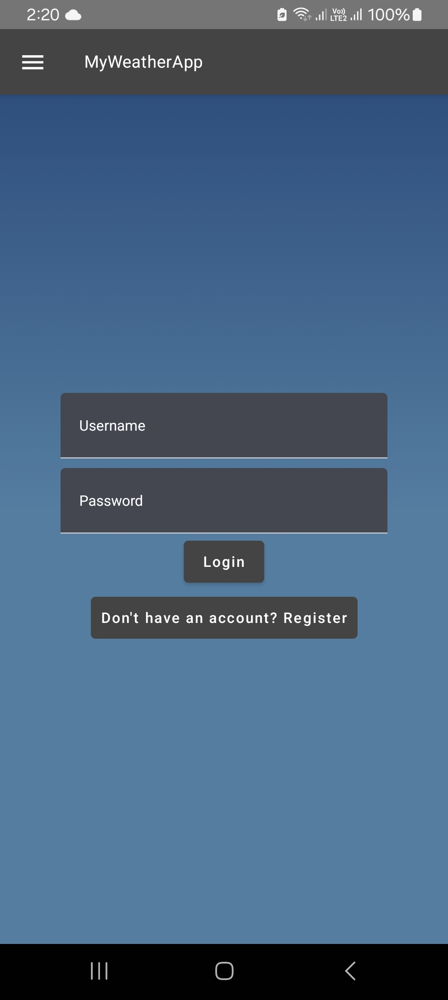
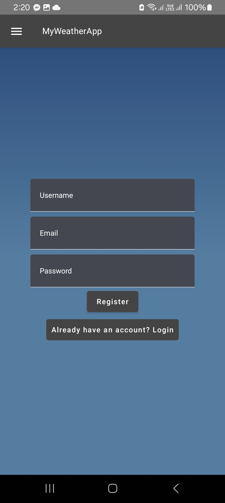
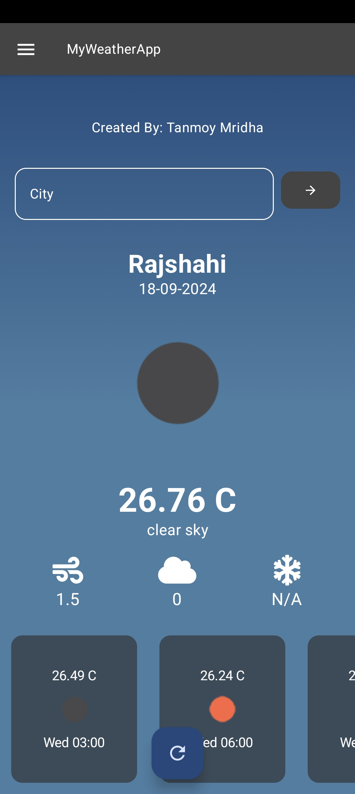
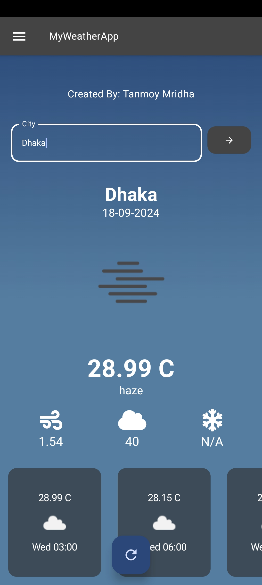
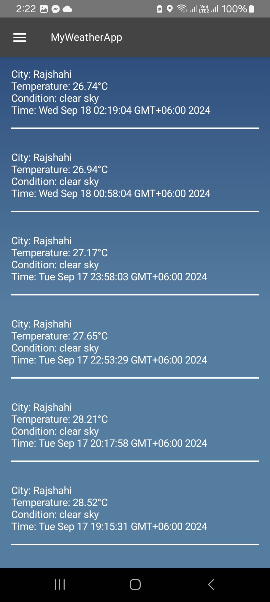

<div align="center">

  <h1 align="center">MyWeatherApp</h1>
  <p align="center">A Kotlin Weather app</p>
</div>

An Android weather application built using Jetpack Compose, MVVM architecture, Retrofit for API calls to OpenWeatherMapApi, and Room for SQLite database. The app allows users to register and log in, fetch weather updates, store history, and display real-time notifications.

## Features

- **User Registration and Login**: Users can create an account and log in.
- **Weather Information**: Displays real-time Weather and Forecast using the OpenWeatherMap API.
- **Weather History**: Weather data is stored in SQLite database (Room) every hour and can be viewed in a history screen.
- **Persistent Notification**: A notification showing current weather data is updated every hour.

## Technologies Used

- **Jetpack Compose**: For the UI
- **ViewModel**: For mVVM Architecture
- **Retrofit**: For network requests to OpenWeatherMap API
- **Room Database (SQLite)**: For local database storage
- **WorkManager**: To fetch and update weather data in the background every 1h

## How It Works

### 1. User Registration and Login
- The app stores user credentials in the SQLite database via Room. Users can register and then log in with their username and password.

### 2. Fetching Weather Data
- Weather data is fetched from the OpenWeatherMap API using Retrofit by city name of latitude & longitude.

### 3. Storing Weather History
- Every hour, the app fetches the latest weather data and stores it in the SQLite database. The data is then viewable from the history section in the app's drawer menu.

### 4. Notifications
- A notification is triggered when the app is opened and updated every hour with the latest weather data. The notification persists until the app is closed.

[//]: # (## External Dependencies)

[//]: # ()
[//]: # (- Jetpack Compose UI)

[//]: # (- ViewModel)

[//]: # (- Navigation)

[//]: # (- Room Database&#40;Sqlite&#41;)

[//]: # (- Location Services)

[//]: # (- Retrofit)

[//]: # (- Coil Compose)

[//]: # (- WorkManager)

[//]: # (- Awesome Font)

## Download

Download the apk from the release section (https://github.com/Tanmoym047/MyWeatherApp/releases)

## Build Manual

### Package & Software Requirements

| Component               | Version/Details                  |
|-------------------------|----------------------------------|
| **IDE**                 | Android Studio (2023 or later)   |
| **Installed Packages**  |                                  |
| `Jetpack Compose UI`    | 1.9.1                            |
| `Kotlin Coroutine`      | 1.8.1                            |
| `ViewModel`             | 2.6.1                            |
| `Navigation`            | 2.8.0                            |
| `Room Database(Sqlite)` | 2.6.1                            |
| `Location Services`     | 21.3.0                           |
| `Retrofit`              | 2.11.0                           |
| `GSON`                  | 2.10.1                           |
| `okhttp`                | 5.0.0-alpha.2                    |
| `Coil Compose`          | 2.7.0                            |
| `WorkManager`           | 2.9.1                            |
| `Awesome Font`          | 1.0.0                            |

### Installation

- Download & Install latest Android Studio IDE (https://developer.android.com/studio)
- Configure an Android Emulator in the IDE
- Clone the project repository using:
    ```bash
      git clone https://github.com/Tanmoym047/MyWeatherApp
    ```
- Make Sure all the dependencies are added in the build file (build.gradle.kts:app) in the project   
- Run the build to run the emulator and app.

## Screenshots

<div align="center">
    
    
    
    
      
</div>


